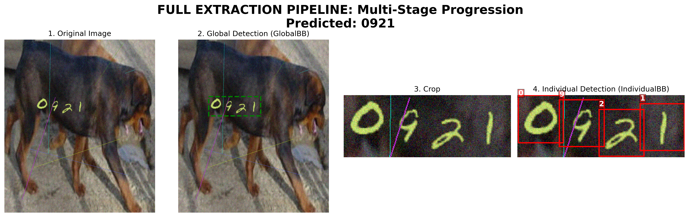

# ExtractNumbers

A comprehensive image recognition and segmentation dataset generation pipeline for digit extraction from noisy environments.

## Initial Setup

1. **Install Dependencies**:
   Ensure you have Python 3.12+ installed. Create a virtual environment and install the requirements:

   ```bash
   python3 -m venv .venv
   source .venv/bin/activate
   pip install -r requirements.txt
   ```

2. **Run Data Preparation**:
   The entire data fetching and processing pipeline is automated. Just run the following command from the project root:

   ```bash
   python src/prep_data.py
   ```


   **Dataset sizes after preparation:**

   | Dataset | Type | Samples |
   | :--- | :--- | :---: |
   | **SVHN / Digits** | Fully Labeled | 33,402 |
   | **Handwritten** | Fully Labeled (Synthetic) | 10,000 |
   | **Race Numbers** | Fully Labeled | 30 |
   | **Trains OCR** | Weakly Labeled | 13 |

---

## 📂 Project Structure
The source code is organized into specialized modules:

* **[`src/training/`](src/training/README.md)**: Full pipeline training orchestrators.
* **[`src/inference/`](src/inference/README.md)**: Production prediction scripts.
* **[`src/data/`](src/data/README.md)**: Dataset loading and normalization.
* **[`src/bounding_box/`](src/bounding_box/README.md)**: Stage 1 & 3 YOLO detection.
* **[`src/image_preprocessing/`](src/image_preprocessing/README.md)**: Optional image preprocessing utilities.
* **[`src/digit_recognizer/`](src/digit_recognizer/README.md)**: Stage 3 ResNet18 classification.
* **[`src/evaluation/`](src/evaluation/README.md)**: Multi-stage benchmarking suite.
* **[`src/utils/`](src/utils/README.md)**: Shared helper functions.

For a comprehensive technical reference of all scripts, see the **[Source API Documentation](src/API.md)**.

---

## Pipeline Workflow

The extraction process is divided into three core stages:

1.  **Global Bounding-Box Detection (GlobalBB):** Localizes the entire number sequence within the noisy source image and extracts the crop.
2.  **Individual Digit Localization (IndividualBB):** Detects and segments each digit individually within the cropped sequence.
3.  **Neural Character Recognition (Classification):** ResNet18-based classification of localized digits into final values (0-9).


---

### Core Pipeline Execution

The system is designed for high-performance batch processing and seamless model synchronization.

**To run the staged pipeline on a video using Slurm (defaults to randomly sampling 1 in 10 frames):**
```bash
sbatch slarm_code/run_generic.slurm src/inference/run_pipeline.py \
    --video path/to/video.mp4 \
    --out-dir outputs/video_results \
    --model-dir outputs/trained_models \
    --classifier outputs/trained_models/digit_recognizer.pt
```

*Example (processing a specific dataset video with a specific strategy):*
```bash
sbatch slarm_code/run_generic.slurm src/inference/run_pipeline.py \
    --video data/DSText_V2/Game/Video_150_5_0.mp4 \
    --out-dir outputs/video_150_results \
    --model-dir outputs/trained_models \
    --classifier outputs/trained_models/digit_recognizer.pt
```

**To train and run the full batch pipeline:**
```bash
python src/training/train_pipeline.py
```

**To run prediction on a single image:**
```bash
python src/inference/predict_single.py path/to/image.png
```

**To visualize the prediction pipeline on a single image:**
```bash
python src/inference/visualize_pipeline.py path/to/image.png -o pipeline_viz.png
```

#### Control Flags
- `--force-train`: Forces a fresh training cycle for both YOLO stages.
- `--force-inference`: Forces re-running of all inference stages even if results already exist.
- `--analyze-only`: Skips detection/training and generates reports from previous results.
- `--viz-only`: Regenerates the progression visualizations from existing predictions.

---

## Evaluation & Insights

The pipeline is evaluated across four isolated stages and one comprehensive end-to-end benchmark.

### 🔍 Metric Definitions
To ensure clarity across all reports, the following metrics are used:
*   **Mean IoU (Intersection over Union)**: Measures the spatial overlap between the predicted bounding box and the ground truth. A score of 1.0 is a perfect match.
*   **mAP@0.5**: "Mean Average Precision" at a 50% IoU threshold. This is the standard accuracy metric for object detection.
*   **Precision**: The percentage of positive predictions that were actually correct (Quality).
*   **Recall**: The percentage of actual ground truth objects that were successfully detected (Quantity).
*   **Full Sequence Accuracy**: The percentage of images where the **entire** predicted number string exactly matches the ground truth.
*   **Mean Digit Accuracy (Pos)**: The percentage of digits correctly identified at their specific index in the sequence.

### 📊 Stage 1: Global Bounding Box Detection
*Evaluates the ability to localize the entire number sequence.*

| Category | Mean IoU | Precision | Recall | mAP@0.5 |
| :--- | :--- | :--- | :--- | :--- |
| **Overall** | **0.8103** | **96.10%** | **98.92%** | **95.06%** |
| **Handwritten** | 0.8624 | 98.30% | 97.14% | 95.49% |
| **SVHN** | 0.7947 | 95.45% | 99.45% | 94.93% |

### 📊 Stage 2: Individual Digit Localization
*Evaluates digit segmentation within cropped sequences.*

| Category | Mean IoU | Recall |
| :--- | :--- | :--- |
| **Overall** | **0.8515** | **99.32%** |
| **Handwritten** | 0.9154 | 99.98% |
| **SVHN** | 0.8375 | 99.01% |

### 📊 Stage 3: Digit Classification
*Isolated classification performance (ResNet18).*

| Category | Accuracy | Support |
| :--- | :--- | :--- |
| **Overall** | **94.50%** | **25,120 digits** |
| **Handwritten** | 92.84% | — |
| **SVHN** | 95.30% | — |

### 🏆 Full End-to-End Pipeline Performance
*Master benchmark: Raw pixels → Final predicted string.*

| Metric | Overall | Handwritten | SVHN |
| :--- | :--- | :--- | :--- |
| **Full Sequence Accuracy** | **80.53%** | **72.39%** | **82.94%** |
| **Mean Digit Accuracy (Pos)**| **89.81%** | **88.24%** | **90.27%** |
| **Stage 1 Mean IoU** | **0.8147** | **0.8749** | **0.7969** |
| **Stage 2 Mean IoU** | **0.7646** | **0.8682** | **0.7342** |

*(Sampled proportionally — SVHN ~76.9%, Handwritten ~23.1%. Run with `--balanced` for a fair 50/50 view.)*

### 📊 Video Evaluation Suite (Real-World Benchmarks)
*Evaluates the staged pipeline performance on real-world video datasets.*

| Category | Seq Acc | Digit Acc | Stage 1 (Global) IoU | Stage 3 (Indiv) IoU | Labeled Frames |
| :--- | :---: | :---: | :---: | :---: | :---: |
| **Overall** | **0.40%** | **0.71%** | **0.0195** | **0.0207** | **2,097** |
| **`bovtext`** | 0.00% | 0.00% | 0.0000 | 0.0000 | 10 |
| **`roadtext`** | 0.00% | 0.21% | 0.0002 | 0.0004 | 1,065 |
| **`dstext_v2`** | 0.00% | 0.25% | 0.0021 | 0.0009 | 886 |
| **`moving_mnist`** | 0.00% | 0.00% | 0.6242 | 0.5732 | 60 |
| **`mock_video`** | 100.00% | 100.00% | 0.8253 | 0.6669 | 10 |
| **`icdar_svt`** | 0.00% | 0.00% | 0.0000 | 0.0000 | 10 |

> [!WARNING]
> There is a severe **scale and domain mismatch** in Stage 1 global sequence localization on high-resolution videos (e.g., `dstext_v2`, `roadtext`). The model was trained on cropped sequences where numbers occupy a massive portion of the frame, failing completely when sequence boundaries occupy less than 0.005% of full-sized video frames.

---


### How to Run Evaluations
The suite is divided into scripts for isolated performance analysis across both image and video datasets.

#### 🖼️ Image Evaluations
You can choose between proportional stratified sampling (default) or balanced equal-split sampling:

```bash
# Run ALL image evaluations with default proportional sampling
python src/evaluation/eval_all.py --max-samples 5000

# ⭐ RECOMMENDED: Run with perfectly balanced 50/50 split for stable cross-version comparisons
python src/evaluation/eval_all.py --max-samples 2000 --balanced

# Full End-to-End image pipeline benchmark with error analysis dashboard
python src/evaluation/eval_pipeline.py --max-samples 500 --save-viz --analyze-errors
```

#### 🎥 Video Evaluations
Evaluate frame-by-frame processing of videos. The suite supports evaluating exactly the labeled frames or running frame selectors:

```bash
# Run ALL video evaluations on exactly the annotated frames
python src/evaluation/eval_video_all.py --max-samples 10 --strategy annotated

# Run video evaluations with uniform selection strategy
python src/evaluation/eval_video_all.py --max-samples 10 --strategy uniform --k 5

# Run end-to-end video pipeline benchmark only
python src/evaluation/eval_video_pipeline.py --max-samples 5 --save-viz --analyze-errors
```

## 📊 Dataset Integration
The pipeline now supports "Weakly Labeled" datasets—data that contains global number/plate bounding boxes and sequence labels but lacks fine-grained individual digit annotations.

| Dataset | Type | Samples | Command to Prepare |
| :--- | :--- | :---: | :--- |
| **Trains OCR** | Weakly Labeled | 13 | `python src/data/ocr_trains.py` |
| **Race Numbers** | Fully Labeled | 30 | `python src/prep_data.py --datasets race_numbers` |
| **Handwritten** | Fully Labeled | **10,000** | `python src/prep_data.py --datasets handwritten` |
| **SVHN / Digits** | Fully Labeled | 33,402 | `python src/prep_data.py --datasets svhn` |
| **Moving MNIST** | Video Dataset | 5 sequences | `python src/prep_data.py --datasets moving_mnist` |
| **DSText V2** | Video Dataset | 2 sequences | `python src/prep_data.py --datasets dstext_v2` |
| **RoadText** | Video Dataset | 2 sequences | `python src/prep_data.py --datasets roadtext` |
| **BOVText** | Video Dataset | 2 sequences | `python src/prep_data.py --datasets bovtext` |
| **ICDAR SVT** | Video Dataset | 2 sequences | `python src/prep_data.py --datasets icdar_svt` |

### Handling Weakly Labeled Data
When a dataset is identified as weakly labeled (`has_digit_boxes=False` in `annotations.json`):
1.  **Stage 1 (Global Detection)**: Evaluated as normal using Mean IoU.
2.  **Stage 2 (Individual Detection)**: Skipped for metric calculation to avoid statistical contamination.
3.  **End-to-End Accuracy**: Calculated by comparing the final OCR output with the ground truth sequence label.

### Pipeline Example

End-to-end extraction on a real handwritten sample — from noisy source image to final predicted digit sequence:



---

## 🖼️ Generate a Pipeline Visualization

To produce a 4-stage visual walkthrough (Original → Global Detection → Crop → Individual Detection with labels) for any image:

```bash
# On a specific image
python src/inference/visualize_pipeline.py path/to/image.png -o output.png

# On a randomly selected image from the dataset
python src/inference/visualize_pipeline.py random -o output.png
```

